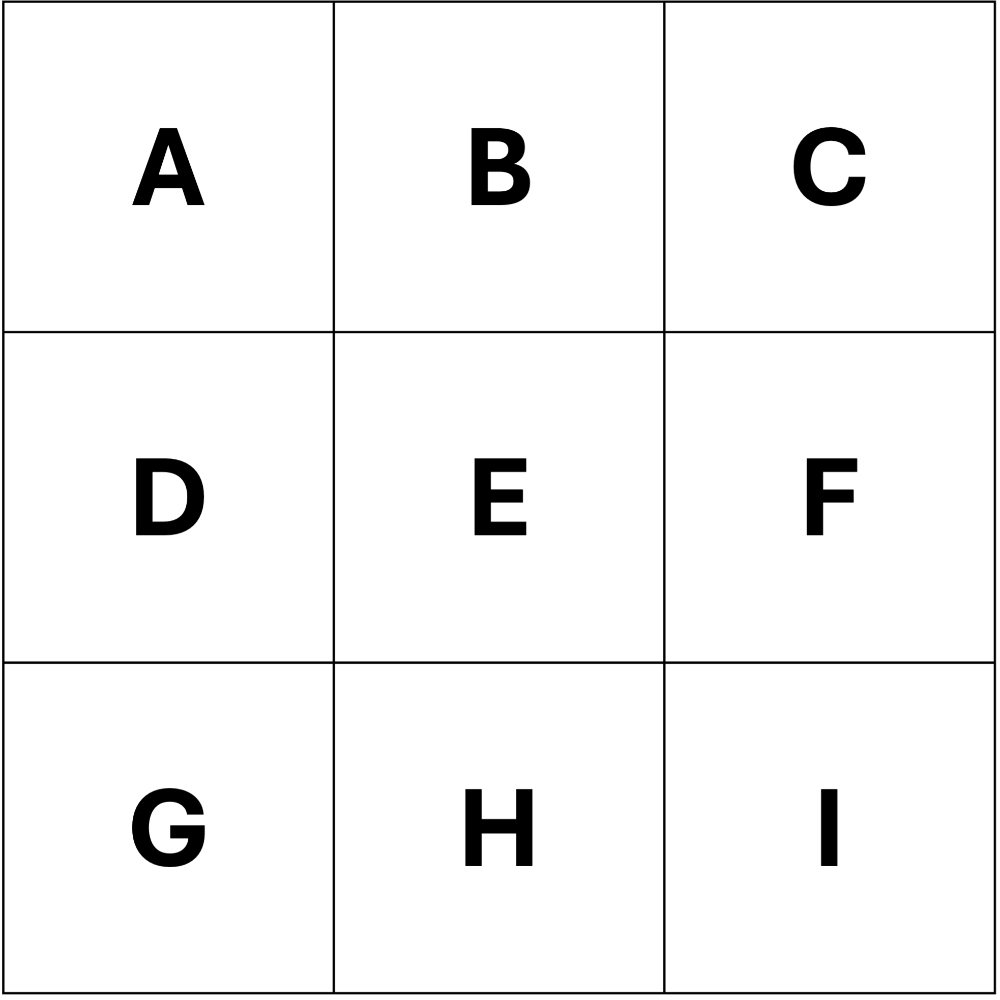
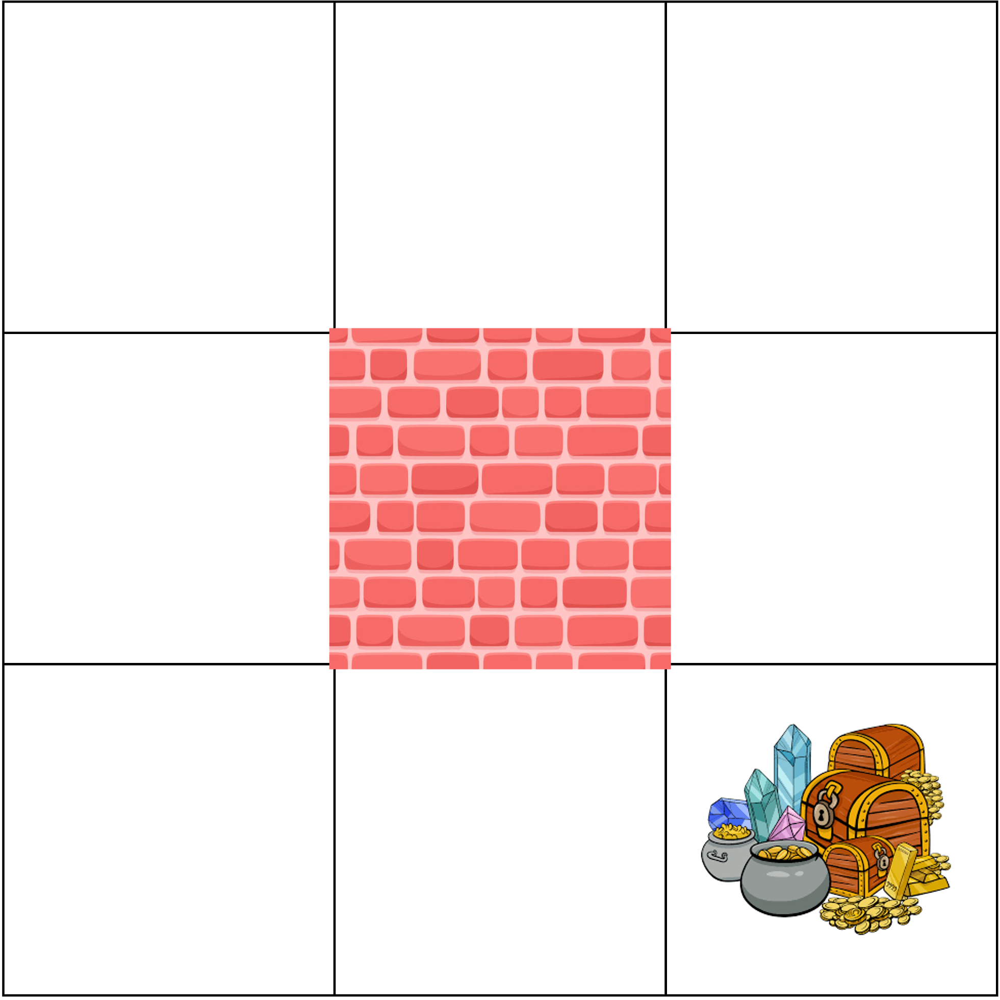

# Midterm Exam 

**Instructions:**  
- Show all steps for computations.   
- Total: **50 points**

---

### 1. Define a Markov Decision Process (MDP). List its key components. **(5 pts)**

---

### 2. What does it mean for a process to satisfy the Markov property? **(5 pts)**

---

### 3. Explain the difference between a policy and a value function. **(5 pts)**

---

### 4. What is the role of the discount factor $(γ)$ in an MDP? **(5 pts)**  
- What happens when $γ = 0$ and when $γ → 1?$ 

---

### 5. Two-State weather MDP (15 pts)

Consider an agent deciding what to do depending on the weather.  

There are two states:

- **Sunny**  
- **Rainy**  

The agent has two possible actions in each state:

- **Go Out (G)**  
- **Stay Inside (I)**  

The reward function is given as follows:

- $R(Sunny, G) = +2$ (enjoy going out on sunny days)  
- $R(Sunny, I) = 0$ (wastes the sunny day by staying in)  
- $R(Rainy, G) = +1$ (going out in rain is not so fun)  
- $R(Rainy, I) = +3$ (enjoys relaxing indoors while it rains)  

Transitions are deterministic:
- If it is **Sunny**, regardless of action, the next state will always be **Rainy**.  
- If it is **Rainy**, regardless of action, the next state will always be **Sunny**.  

- The discount factor is $\gamma = 0.5$.  
- The agent follows a **uniform random policy**, in each state it chooses **Go Out** or **Stay Inside** with probability **0.5**

**(a)** Compute the average expected reward for $Sunny$. **(2 pts)**

**(b)** Compute the average expected reward for $Rainy$. **(2 pts)**

**(c)** Using the bellman expectation equation, solve for $v_\pi(Sunny)$  **(5 pts)**

**(d)** Using the bellman expectation equation, solve for $v_\pi(Rainy)$. **(6 pts)**

---

### 6. Consider the following gridworld MDP: **(15 pts)**  
- A $3×3$ grid with states labeled $A$ to $I$. 

- State $E$ is a **wall**
- State $I$ is the **terminal state**
- States $A,B,C,D,F,G,H$ are the **non-terminal states**

- Agent can move ${up, down, left, right}$. 
- Bumping into a wall will put the agent back to the previous state.  
- Reward is $-1$ per step for every transition into a non-terminal state. 
- Entering state $I$ yields a reward of $0$ and the episode ends.  
- Discount factor: $\gamma = 1$.
- The agent **starts with a uniform random policy**. At each state, each action has probability $0.25$.  

**(a)** Using dynamic programming, compute the optimal state-value function $v_*(s)$ for all non-terminal states. **(9 pts)**

**(b)** Find the optimal  policy $\pi_*(s)$ for all non-terminal states. **(6 pts)**

